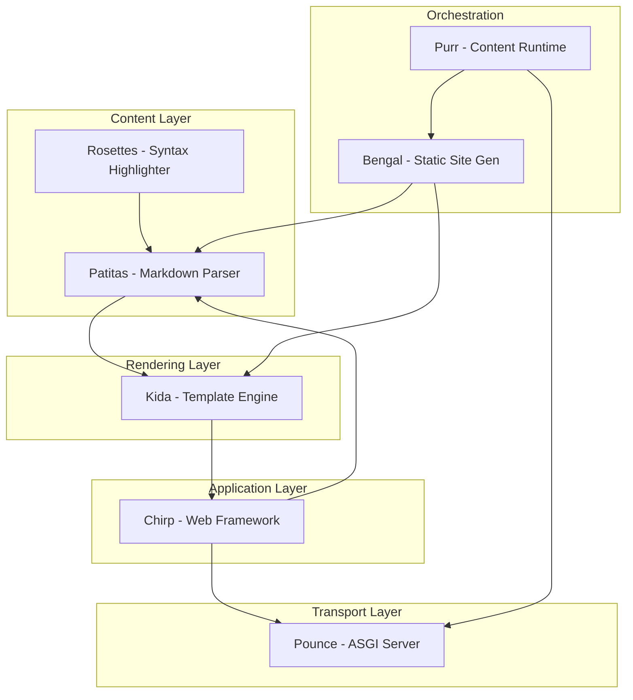

# The Bengal Ecosystem

A structured reactive stack — every layer written in pure Python for 3.14t free-threading.

## Stack Overview

| | | | |
|--:|---|---|---|
| **ᓚᘏᗢ** | [Bengal](https://github.com/lbliii/bengal) | Static site generator | [Docs](https://lbliii.github.io/bengal/) |
| **∿∿** | **Purr** | Content runtime ← You are here | — |
| **⌁⌁** | [Chirp](https://github.com/lbliii/chirp) | Web framework | [Docs](https://lbliii.github.io/chirp/) |
| **=^..^=** | [Pounce](https://github.com/lbliii/pounce) | ASGI server | [Docs](https://lbliii.github.io/pounce/) |
| **)彡** | [Kida](https://github.com/lbliii/kida) | Template engine | [Docs](https://lbliii.github.io/kida/) |
| **ฅᨐฅ** | [Patitas](https://github.com/lbliii/patitas) | Markdown parser | [Docs](https://lbliii.github.io/patitas/) |
| **⌾⌾⌾** | [Rosettes](https://github.com/lbliii/rosettes) | Syntax highlighter | [Docs](https://lbliii.github.io/rosettes/) |

Python-native. Free-threading ready. No npm required.
